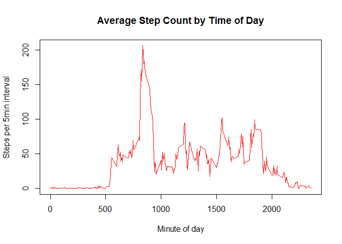

# Reproducible Research: Peer Assessment 1

## Loading and preprocessing the data

```r
## Install and load libraries
.libPaths("c:/temp/rpackages")
suppressWarnings({
  # install.packages(c("data.table", "knitr", "ggplot2"))
  library("data.table")
  library("knitr")
  library(ggplot2)
})

opts_chunk$set(echo=TRUE)

# Loading and preprocessing the data
unzip("activity.zip")
activity <- read.csv("activity.csv", na.strings = "NA", header = T)
activity[,"date"] <- as.Date(activity$date)
activity[,"DateTime"] <-
  as.POSIXct(paste(activity$date, sprintf("%04d",activity$interval)),
             "%Y-%m-%d %H%M", tz="GMT")
activity <- as.data.table(activity)
```

## What is mean total number of steps taken per day?

```r
complete_activity <- activity[complete.cases(activity),]
steps_per_day = aggregate(. ~ date, data = activity, FUN=sum)[,c("date", "steps")]
ggplot(steps_per_day, aes(x=date, weights=steps)) + geom_histogram(aes(fill = ..count..),binwidth = 1) + scale_fill_gradient(high="green", low="red")
```

 

```r
average_steps_per_day = list(mean = mean(steps_per_day$steps),
                             median = median(steps_per_day$steps))
average_steps_per_day
```

```
## $mean
## [1] 10766.19
## 
## $median
## [1] 10765
```


## What is the average daily activity pattern?

```r
steps_per_interval = aggregate(. ~ interval, data = activity, FUN=mean)[,c("interval", "steps")]
plot(y=steps_per_interval$steps, x=steps_per_interval$interval, type='l',
     ylab = "Steps per 5min interval", xlab = "Minute of day", main="Average Step Count by Time of Day", col = "red")
```

 

```r
best_interval <- steps_per_interval[which.max(steps_per_interval$steps),]
```
The best interval (on average) is 835 with 206.1698113 steps.

## Imputing missing values


## Are there differences in activity patterns between weekdays and weekends?
