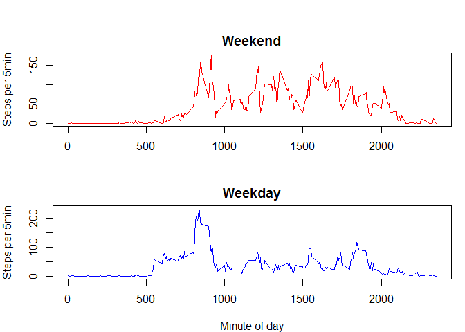
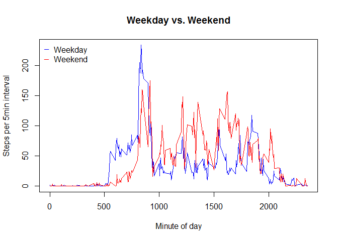

# Reproducible Research: Peer Assessment 1

## Loading and preprocessing the data

```r
## Install and load libraries
.libPaths("c:/temp/rpackages")
suppressWarnings({
  # install.packages(c("data.table", "knitr", "ggplot2"))
  library("data.table")
  library("knitr")
  library(ggplot2)
})

opts_chunk$set(echo=TRUE)

# Loading and preprocessing the data
unzip("activity.zip")
remove(activity)
```

```
## Warning in remove(activity): object 'activity' not found
```

```r
activity <- read.csv("activity.csv", na.strings = "NA", header = T)
activity[,"date"] <- as.Date(activity$date)
activity[,"DateTime"] <-
  as.POSIXct(paste(activity$date, sprintf("%04d",activity$interval)),
             "%Y-%m-%d %H%M", tz="GMT")
# activity <- as.data.table(activity)
# setkey(activity, c("date", "interval"))
```

## What is mean total number of steps taken per day?

```r
steps_per_day = aggregate(. ~ date, data = activity, FUN=sum)[,c("date", "steps")]

ggplot(steps_per_day, aes(x=date, weights=steps)) +
  geom_histogram(aes(fill = ..count..),binwidth = 1) +
  scale_fill_gradient(high="green", low="red")
```

 

```r
hist(steps_per_day$steps, col="green", main = "Steps per day")
```

 

```r
average_steps_per_day = list(mean = mean(steps_per_day$steps),
                             median = median(steps_per_day$steps))
average_steps_per_day
```

```
## $mean
## [1] 10766.19
## 
## $median
## [1] 10765
```


## What is the average daily activity pattern?

```r
steps_per_interval = aggregate(. ~ interval, data = activity, FUN=mean)[,c("interval", "steps")]
plot(y=steps_per_interval$steps, x=steps_per_interval$interval, type='l',
     ylab = "Steps per 5min interval", xlab = "Minute of day",
     main="Average Step Count by Time of Day", col = "red")
```

 

```r
best_interval <- steps_per_interval[which.max(steps_per_interval$steps),]
```
The best time of day interval is 835 with 206 steps on average.

## Imputing missing values

Some of the data is missing (not available).  This section replaces missing data with the average for that interval.


```r
for(i in 1:nrow(activity)){
  interval <- activity[i, "interval"]
  avg_steps <- steps_per_interval[which(steps_per_interval$interval == interval), "steps"][1]
  activity[i, "imputed_steps"] <-
    if(is.na(activity[i, "steps"]))
      avg_steps
    else
      activity[i, "steps"]
}

imputed_steps_per_day = aggregate(. ~ date, data = activity[,c("date", "imputed_steps")], FUN=sum)[,c("date", "imputed_steps")]

ggplot(imputed_steps_per_day, aes(x=date, weights=imputed_steps)) +
  geom_histogram(aes(fill = ..count..),binwidth = 1) +
  scale_fill_gradient(high="green", low="red")
```

 

```r
hist(imputed_steps_per_day$imputed_steps, col="green", main = "Imputed Steps per day")
```

 

```r
imputed_average_steps_per_day = list(mean = mean(imputed_steps_per_day$imputed_steps),
                                     median = median(imputed_steps_per_day$imputed_steps))
imputed_average_steps_per_day
```

```
## $mean
## [1] 10766.19
## 
## $median
## [1] 10766.19
```

The mean values between the observed data and imputed data are the same.  The median value of the imputed data is the same as the mean.

## Are there differences in activity patterns between weekdays and weekends?

*Note:* This section uses imputed data.


```r
imputed_steps_per_interval_by_day_of_week <- function(days){
  aggregate(. ~ interval,
            data = activity[weekdays(activity$DateTime) %in% days,],
            FUN=mean)[,c("interval", "imputed_steps")]
}

# Weekend
weekend_steps_per_interval <- imputed_steps_per_interval_by_day_of_week(
  c('Saturday','Sunday'))
weekend_best_interval <- weekend_steps_per_interval[which.max(weekend_steps_per_interval$imputed_steps),]

# Weekday
weekday_steps_per_interval <- imputed_steps_per_interval_by_day_of_week(
  c('Monday','Tuesday',"Wednesday","Thursday","Friday"))

weekday_best_interval <- weekday_steps_per_interval[which.max(weekday_steps_per_interval$imputed_steps),]

# Plot 
par(mfrow = c(2, 1), mar = c(4,4,2,1), oma = c(0,0,2,0))

plot(y=weekend_steps_per_interval$imputed_steps, x=weekend_steps_per_interval$interval, type='l',
     ylab = "Steps per 5min", xlab = "",
     main="Weekend", col = "red")

plot(y=weekday_steps_per_interval$imputed_steps, x=weekday_steps_per_interval$interval, type='l',
     ylab = "Steps per 5min", xlab = "Minute of day",
     main="Weekday", col = "blue")
```

 

The best weekend time of day interval is 915 with 175 steps on average.

The best weekday time of day interval is 835 with 234 steps on average.

Here the charts are overlaid:


```r
plot(y=weekday_steps_per_interval$imputed_steps, x=weekday_steps_per_interval$interval,
     ylab = "Steps per 5min interval", xlab = "Minute of day",
     main="Weekday vs. Weekend",
     type='l', col = "blue")

lines(y=weekend_steps_per_interval$imputed_steps, x=weekend_steps_per_interval$interval,
      type='l', col = "red")

legend("topleft",
       legend=c("Weekday","Weekend"),
       col = c("Blue","Red"),
       bty = "n",
       pch = "_")
```

 

## Summary

From these images, we can infer that the individual rises 2-3 hours earlier on the weekdays than the weekend and often stays active later into the evening on the weekends.
